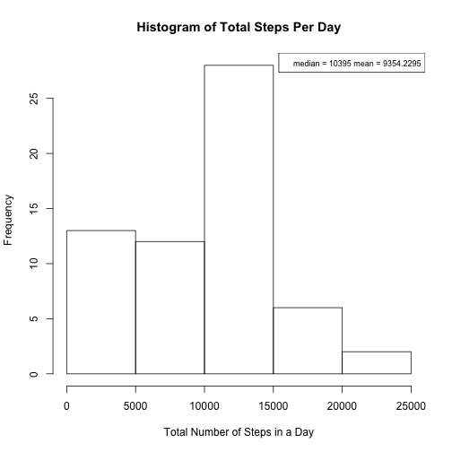
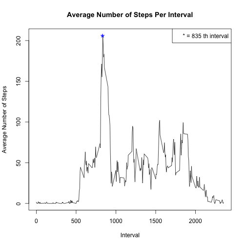
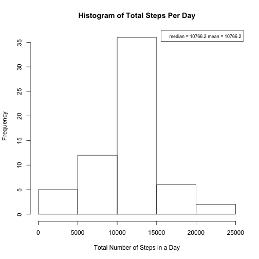
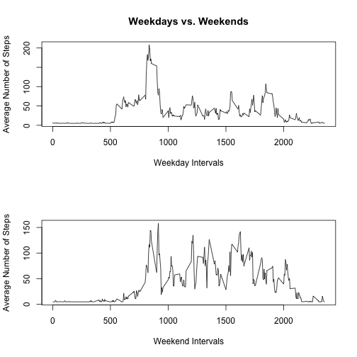

PA1_template
============


**Let's start off by loading the necessary pacakges.**

```r
library(dplyr)
library(knitr)
```


**Here we're going to load some data and process it a bit.**

Initial processing steps include:

- Unzip
- Read csv file
- Turn it into a table dataframe for dplyr operations
- Convert the dates to actual date objects


```r
unzip(zipfile = "repdata-data-activity.zip")
activity <- read.csv("activity.csv")
activity_tbl <- tbl_df(activity)
activity_tbl$date <- as.Date(activity_tbl$date)
```

**What is mean total number of steps taken per day?**

Here we are grouping the data by date and summing the total number of steps for each day. Median and Mean values are noted in the legend.


```r
date_grouped <- group_by(activity_tbl, date)
date_group_sum <- summarize(date_grouped, daily_total = sum(steps, na.rm=TRUE))
hist(date_group_sum$daily_total, main=paste("Histogram of Total Steps Per Day"), xlab= "Total Number of Steps in a Day", ylab= "Frequency")
legend("topright", c(paste("median =", round(median(date_group_sum$daily_total, na.rm=TRUE), digits=4), paste("mean =", round(mean(date_group_sum$daily_total, na.rm=TRUE), digits=4)))), cex=.75)
```

 

**What is the average daily activity pattern?**

Here we are grouping instead by interval and finding the mean number of steps for each interval. The interval with the greatest average number of steps is denoted by a blue star.


```r
interval_group <- group_by(activity_tbl, interval)
interval_group_sum <- summarize(interval_group, interval_average = mean(steps, na.rm=TRUE))
with(interval_group_sum, plot(interval, interval_average, type="l", xlab= "Interval", ylab="Average Number of Steps", main=paste("Average Number of Steps Per Interval")))
points(interval_group_sum$interval[which(interval_group_sum$interval_average == max(interval_group_sum$interval_average))], max(interval_group_sum$interval_average, na.rm=TRUE), pch = c("*"), col="blue", cex= 2)
legend("topright", paste("* =", interval_group_sum$interval[which(interval_group_sum$interval_average == max(interval_group_sum$interval_average))],"th interval"))
```

 

**Imputing missing values.**

Here we are replacing the NA values with the mean number of steps per interval over the entire data set. I've created a function *impute* that goes through the steps data column and outputs the mean value if NA is encountered and the original value if a real number if encountered. The final output of *impute* is a vector which is used to replace the old steps column with. A histogram is made similar to the one above, but with this new imputed dataset. Not surprisingly, imputing the average number of steps for missing values makes the histogram more peaked around the mean; this is likely due to the decrease in number of  values near 0.


```r
sum(is.na(date_grouped$steps))
```

```
## [1] 2304
```

```r
impute <- function(x) {
        if (is.na(x)) {
                x <- mean(activity[,1], na.rm=TRUE)
        }
        else {
                x <- x
        }
}
activity$steps <- as.numeric(lapply(activity$steps,impute))
activity_tbl2 <- tbl_df(activity)
activity_tbl2$date <- as.Date(activity_tbl$date)
date_grouped2 <- group_by(activity_tbl2, date)
date_group_mean2 <- summarize(date_grouped2, daily_total = sum(steps, na.rm=TRUE))
hist(date_group_mean2$daily_total, main=paste("Histogram of Total Steps Per Day"), xlab= "Total Number of Steps in a Day", ylab= "Frequency")
legend("topright", c(paste("median =", round(median(date_group_mean2$daily_total, na.rm=TRUE), digits=1), paste("mean =", round(mean(date_group_mean2$daily_total, na.rm=TRUE), digits=1)))), cex=.75)
```

 

**Are there differences in activity patterns between weekdays and weekends?**

Here I've created a function *factor_day* that when *lapply*-ed to the date column, will output whether the date was on a "Weekday" or "Weekend". I then create a new column in my dataset that includes these values. To make two different plots, I first filtered the dataset based off of the wk variable. Once separated, I then individually grouped each one by interval. 


```r
factor_day <- function(x) {
        
        z <- c()
        if ((weekdays(x) %in% c("Monday","Tuesday","Wednesday","Thursday","Friday")))
        {
        z <- c(z,"Weekday")
        }
        else {
        z <- c(z,"Weekend")
        }
       
}

ungroup(date_grouped2)
```

```
## Source: local data frame [17,568 x 3]
## 
##      steps       date interval
## 1  37.3826 2012-10-01        0
## 2  37.3826 2012-10-01        5
## 3  37.3826 2012-10-01       10
## 4  37.3826 2012-10-01       15
## 5  37.3826 2012-10-01       20
## 6  37.3826 2012-10-01       25
## 7  37.3826 2012-10-01       30
## 8  37.3826 2012-10-01       35
## 9  37.3826 2012-10-01       40
## 10 37.3826 2012-10-01       45
## ..     ...        ...      ...
```

```r
factor <-lapply(date_grouped2$date, factor_day)
date_grouped2$wk <- factor 
date_grouped2$wk <- as.character(date_grouped2$wk)
weekday <- filter(date_grouped2, wk == "Weekday")
weekend <- filter(date_grouped2, wk == "Weekend")

weekday_interval <- group_by(weekday, interval)
weekend_interval <- group_by(weekend, interval)

weekday_sum <- summarize(weekday_interval, Interval_Total = mean(steps))
weekend_sum <- summarize(weekend_interval, Interval_Total = mean(steps))


par(mfrow=c(2,1))
plot(weekday_sum$interval, weekday_sum$Interval_Total, type = "l", xlab="Weekday Intervals", ylab= "Average Number of Steps", main = "Weekdays vs. Weekends")
plot(weekend_sum$interval, weekend_sum$Interval_Total, type = "l", ylab= "Average Number of Steps", xlab= "Weekend Intervals")
```

 


